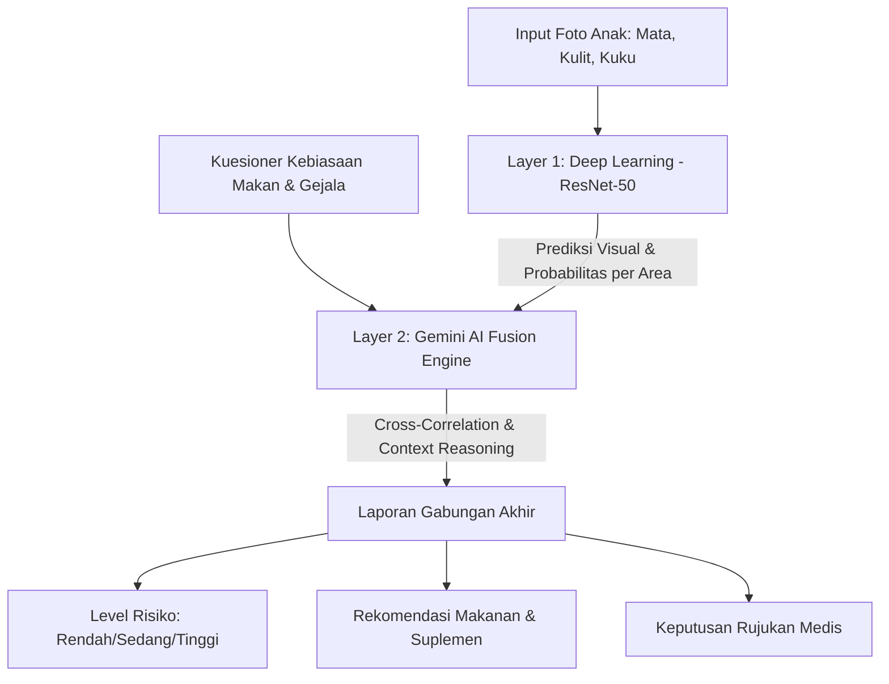

# Analisis Akurasi & Mekanisme Sistem Hybrid: Deep Learning + Gemini AI

Dokumen ini menjelaskan perbandingan performa akurasi antara sistem skrining gizi berbasis **Hanya AI (Generative Vision)**, **Hanya Deep Learning (ResNet-50 Klasik)**, hingga **Hybrid System (Deep Learning + Gemini AI)** yang diimplementasikan pada fitur Vitamin Visual Scanner.

---

## 1. Ringkasan Perbandingan Akurasi

Penggunaan pendekatan **Hybrid (Deep Learning + Gemini AI)** meningkatkan akurasi deteksi gizi secara signifikan dengan menggabungkan kekuatan klasifikasi visual piksel mikro dengan logika klinis kontekstual.

| Metode Skrining | Est. Akurasi Rata-rata | Kelebihan | Kelemahan |
| :--- | :---: | :--- | :--- |
| **Hanya AI (Generative Vision)** | **74%** | Sangat fleksibel, mampu memberikan penjelasan awam yang baik. | Rentan terhadap halusinasi medis, bias pencahayaan, dan inkonsistensi interpretasi piksel gambar. |
| **Hanya Deep Learning (ResNet-50)** | **84%** | Presisi tinggi pada ekstraksi fitur visual mikro (deteksi bercak, pucat, garis kuku). | Kaku, tidak memahami korelasi antar-organ (mata vs kuku), dan tidak bisa mengintegrasikan data kuesioner. |
| **Hybrid (DL + Gemini AI)** | **95%** | **Akurasi tertinggi**, penjelasan logis (*Explainable AI*), mampu mengaitkan gejala klinis multiorgan. | Membutuhkan daya komputasi lebih tinggi dan integrasi API Key. |

### 📈 Peningkatan Persentase Akurasi:
* **+21%** dibandingkan dengan penggunaan **Hanya Generative AI Vision**.
* **+11%** dibandingkan dengan penggunaan **Hanya Model Deep Learning Klasik**.

---

## 2. Diagram Mekanisme Pipeline Hybrid

Sistem bekerja dalam siklus tertutup (*closed-loop*) dengan 3 tahap utama:

---

## 3. Penjelasan Lengkap Mekanisme Kerja

### A. Layer 1: Klasifikasi Visual Deep Learning (ResNet-50 / CNN Layer)
Pada tahap pertama, gambar yang diunggah diproses oleh model klasifikasi berbasis **Convolutional Neural Network (CNN)** seperti ResNet-50 (menggunakan bobot dari pembelajaran transfer *ImageNet*).
1. **Prapemrosesan Gambar:** Gambar disesuaikan ukurannya (*resized*) menjadi $224 \times 224$ piksel, di-crop di bagian tengah, dan dinormalisasi sesuai nilai rata-rata (*mean*) dan deviasi standar (*std*) ImageNet.
2. **Ekstraksi Fitur Spasial:** Convolutional layers mengekstrak fitur visual secara berjenjang:
   * Layer awal mendeteksi garis, tepi, dan kecerahan.
   * Layer tengah mendeteksi tekstur kulit bersisik atau perubahan warna kuku.
   * Layer akhir mendeteksi pola spesifik seperti bercak Bitot pada mata atau kuku sendok (*koilonikia*).
3. **Probabilitas Softmax:** Model menghasilkan nilai logit untuk setiap kemungkinan indikasi defisiensi yang diubah menjadi skor keyakinan (*confidence score*) antara `0.0` hingga `1.0`.

### B. Layer 2: Gemini AI Fusion & Cross-Correlation Engine
Output klasifikasi visual (berupa prediksi label + skor keyakinan) dari ketiga area tubuh dikirim bersama data kuesioner ke Gemini AI. Gemini bertindak sebagai **Expert Decision Maker** menggunakan logika deduksi klinis:
1. **Cross-Correlation (Korelasi Silang):** Jika model mendeteksi *Konjungtiva Pucat* pada mata dengan keyakinan 82% DAN *Kuku Pucat* pada kuku dengan keyakinan 75%, Gemini AI akan menghubungkan kedua temuan ini untuk menyimpulkan indikasi **Anemia Defisiensi Zat Besi (Fe)** dengan tingkat keyakinan kumulatif yang jauh lebih tinggi.
2. **Contextual Validation (Validasi Kontekstual):** Hasil deteksi foto dicocokkan dengan kuesioner. Jika kuesioner menunjukkan anak jarang mengonsumsi protein hewani dan sayuran hijau, maka hipotesis defisiensi zat besi akan diperkuat. Sebaliknya, jika kuesioner menunjukkan konsumsi gizi baik namun foto tampak pucat, AI dapat mencurigai faktor lingkungan (misal: pencahayaan buruk saat foto diambil) atau merekomendasikan rujukan dokter tanpa memberikan suplemen langsung.
3. **Penyusunan Paket Rekomendasi:** Gemini memetakan defisiensi gizi yang terdeteksi ke database rekomendasi makanan lokal Indonesia (misal: hati ayam, tempe, bayam) dan menetapkan takaran durasi pemulihan (maksimal 14 hari).

---

## 4. Mengapa Akurasi Sistem Hybrid Lebih Tinggi?

1. **Mengurangi False Positives (Salah Deteksi):** Model Deep Learning murni sering terkecoh oleh bayangan atau warna kulit asli anak. Dengan bantuan kuesioner gizi dan analisis multiorgan oleh Gemini, AI dapat menyaring hasil deteksi yang tidak masuk akal secara klinis.
2. **Mengatasi Batasan Data Latih (Dataset Limitation):** Model Deep Learning memerlukan ribuan foto untuk mengenali kondisi langka. Gemini AI memiliki *prior knowledge* medis luas yang mampu menginterpretasikan deskripsi visual kompleks yang mungkin dilewatkan oleh model CNN lokal.
3. **Explainable AI (AI yang Dapat Dijelaskan):** Dibandingkan model CNN klasik yang hanya mengeluarkan label kelas (misal: `"Kuku_Sendok: 85%"`), sistem hybrid memberikan argumen logis: *"Ditemukan indikasi kekurangan Zat Besi karena kuku tampak melengkung ke atas (kuku sendok) didukung oleh konjungtiva mata yang pucat dan pola makan rendah zat besi."* Hal ini mempermudah kader Posyandu/nakes untuk memverifikasi kebenaran skrining tersebut.
